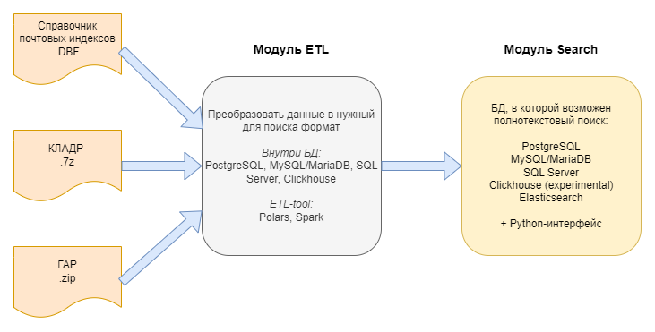

# Address Normalizer
**Цель данного проекта** - приведение российского адреса, заданного произвольной строкой,
к единому формату по аналогии с [API сервиса Dadata](https://dadata.ru/api/suggest/address/). За основу проекта взят
[репозиторий пользователя shigabeev](https://github.com/shigabeev/address-normalizer).

## Контекст
Задача стандартизации адреса возникла у меня, когда я работал над проектом ЦХД для HR-аналитики.
Адреса регистрации и проиживания сотрудников в разных организациях передавались строкой в разных форматах,
и было нужно привести все к единому виду: например, понять, являются ли строки 
"Россия, 119634, г. Москва, ул. Шолохова, д.7, кв. 221" и "Москва, Шолохова 7, 221" одним и тем же адресом.

## Архитектура проекта

Источниками данных для проекта служат:
1. [Эталонный справочник почтовых индексов](https://www.pochta.ru/support/database/ops), представленный файлом в формате dbf
2. [База данных КЛАДР](https://fias.nalog.ru/Frontend) в виде архива 7z с файлами dbf
3. [База данных ГАР](https://fias.nalog.ru/Frontend) в виде архива zip с файлами xml

Проект состоит из двух модулей:
* **ETL**, который отвечает за извлечение данных из источников и их трансформацию в вид, пригодный для создания поискового индекса
* **Search**, который отвечает за преобразование входной адресной строки и поиск адреса в базах данных

Каждый модуль будет реализован несколькими способами: ETL может быть как "внутри" БД (PostgreSQL, MySQL/MariaDB, SQL Server, Clickhouse),
так и отдельным ETL-инструментом (Polars, Spark). Модуль Search реализован в системах хранения данных, которые поддерживают полнотекстовый 
поиск: PostgreSQL, MySQL/MariaDB, SQL Server, Clickhouse (experimental) и Elasticsearch.

## Текущая версия проекта
Pre-alpha

### Roadmap for Alpha 0.1
* Поддержка БД:
  * PostgreSQL
  * MySQL/MariaDB
* Поддержка ETL:
  * Внутри БД
  * Polars
* Python-интерфейс:
  * Поиск в КЛАДР
  * Стандартизация: возвращение словаря и детализированного КЛАДР-адреса
  * Батч-обработка iterable объекта

### Точность поиска
| БД         | Адресная Система | Найдено точное совпадение | Найдено более одного совпадения | Не найдено совпадений |
|------------|------------------|---------------------------|---------------------------------|-----------------------|
| PostgreSQL | КЛАДР            | 48%                       | 50%                             | 2%                    |
